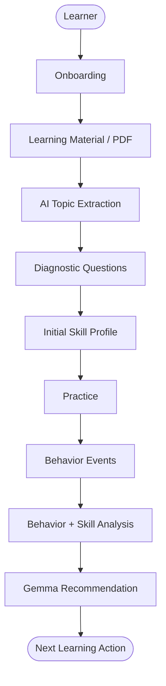
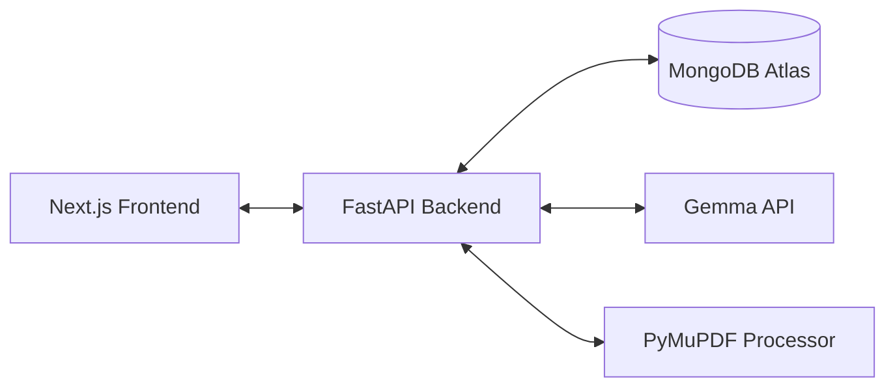

# FriendOS

"An AI that learns how you learn."

FriendOS is an adaptive AI learning companion built for the Hacktoberfest Weekend Challenge: Build for a Friend. 

## Overview

FriendOS is a personalized learning application built for individuals who want a study tool that adapts to their unique learning patterns. It solves the problem of rigid, static learning systems by directly measuring how a learner interacts with the material. Unlike a normal AI chatbot or static quiz generator, FriendOS doesn't just present information—it observes how you answer, how long you take, and when you struggle, then dynamically recommends the best next step to optimize your learning path.

## The Core Idea

Plan → Act → Observe → Learn → Adapt

- **Plan**: Learner provides a goal and uploads a PDF. FriendOS extracts the core topics.
- **Act**: Learner engages in practice sessions or diagnostic assessments.
- **Observe**: The system records behavioral events (time, accuracy, hints, attempts, skips).
- **Learn**: Deterministic logic analyzes the behavioral data to form a skill profile.
- **Adapt**: Gemma recommends the optimal next learning action based on the evidence.

## How FriendOS Works



## Key Features

- **Learner Onboarding**: Customizes the baseline learning profile.
- **PDF Learning Material Upload**: Extracts structured text from uploaded documents via PyMuPDF.
- **AI Topic Extraction**: Leverages Gemma to parse topics from the provided learning material.
- **Diagnostic Question Generation**: Creates targeted assessments based on extracted topics.
- **Deterministic Diagnostic Scoring**: Scores assessments accurately without AI hallucinations.
- **Skill Profile**: Builds a baseline understanding of a learner's strengths and weaknesses.
- **Practice Sessions**: Interactive learning loops focused on improving weak areas.
- **Server-Side Answer Verification**: The backend is the source of truth for answer correctness. It evaluates responses securely and does not trust a client-provided `is_correct` value.
- **Behavior Tracking**: Records granular learning events (response time, hints, attempts, skipped questions).
- **Adaptive Recommendations**: Proposes actions like reviewing a concept or moving to a new topic based on behavior.
- **Recommendation History**: Tracks the timeline of AI decisions for transparency.
- **Production Architecture**: A clear separation of concerns with a React/Next.js frontend and FastAPI backend.

## AI Architecture

FriendOS strictly separates objective measurement from subjective AI reasoning:

**Deterministic Python:**
- Scoring and accuracy calculations
- Attempt counting
- Timing (average response time)
- Hint and skip tracking
- Topic performance statistics

**Gemma (Google AI API):**
- Learning-topic extraction from PDFs
- Diagnostic and practice question generation
- Adaptive recommendation generation

The system **does not** ask the LLM to invent or estimate behavioral statistics; it only feeds verified, objective metrics to Gemma to generate informed recommendations.

## Adaptive Learning

Recommendations are driven by observable application behavior rather than broad psychological claims. 

For example:
- **Weak evidence** (low accuracy, multiple attempts, frequent hints) → `REVIEW_CONCEPT`
- **Strong evidence** (high accuracy, few/no hints, fast responses) → `MOVE_TO_NEXT_TOPIC`

## Architecture



## Project Structure

```
.
├── backend/
│   ├── .env                  # Environment variables
│   ├── requirements.txt      # Python dependencies
│   ├── main.py               # FastAPI entry-point
│   ├── config.py             # Environment config loader
│   ├── database.py           # MongoDB connection helper
│   ├── models/               # Pydantic data models
│   ├── routes/               # API endpoints (health, onboarding, material, etc.)
│   ├── services/             # Core logic and AI service abstractions
│   └── tests/                # Pytest suite
└── frontend/
    ├── package.json          # Node dependencies and scripts
    ├── next.config.ts        # Next.js configuration
    ├── app/                  # Next.js App Router pages
    ├── components/           # React UI components
    └── lib/                  # Frontend utilities
```

## API Endpoints

Important production endpoints in the FastAPI backend:

- `GET /api/health`: Application health check.
- `POST /api/onboard`: Create a new learner profile.
- `POST /api/material/upload`: Upload a PDF for topic extraction.
- `GET /api/api/material/{material_id}`: Retrieve extracted material details.
- `POST /api/diagnostic/start`: Generate diagnostic questions based on topics.
- `POST /api/diagnostic/{session_id}/submit`: Submit a diagnostic assessment for scoring.
- `GET /api/diagnostic/{session_id}`: Fetch diagnostic session details.
- `POST /api/learning/session/start`: Start a new practice session.
- `POST /api/learning/event`: Record a learning behavior event.
- `POST /api/learning/session/{session_id}/complete`: Finalize a practice session.
- `GET /api/learning/session/{session_id}/question`: Get the next practice question.
- `POST /api/learning/session/{session_id}/answer`: Submit a practice answer (server-verified).
- `GET /api/learning/summary/{learner_id}`: Fetch aggregated behavioral summary.
- `POST /api/adaptive/recommend`: Generate a Gemma recommendation based on behavior.
- `GET /api/adaptive/history/{learner_id}`: Retrieve the history of adaptive recommendations.

*(Note: `/api/ai/test` exists as a development-only endpoint when `ENABLE_AI_TEST` is configured).*

## Getting Started

### Prerequisites
- Node.js (v18+)
- Python (3.11+)

### Clone
```bash
git clone https://github.com/Codie-ds/FriendOS.git
cd FriendOS
```

### Backend Setup
```bash
cd backend
python3 -m venv .venv
source .venv/bin/activate
pip install -r requirements.txt
```

### Environment Variables
Create a `.env` file in the `backend/` directory. **Never commit secret values to source control.**

Required variables:
- `MONGODB_URI`: Connection string for MongoDB Atlas (e.g., `mongodb+srv://<user>:<password>@cluster...`).
- `GEMMA_API_KEY`: Your Google Gemini/Gemma API key.
- `GEMMA_MODEL`: The Gemma model to use (e.g., `gemma-4-31b-it`).

Optional variables:
- `CORS_ORIGINS`: Comma-separated list of allowed origins.
- `ENABLE_AI_TEST`: Set to `1` to enable the development AI test route.

### Run Backend
```bash
uvicorn main:app --reload
```

### Run Frontend
```bash
cd frontend
npm install
npm run dev
```

### Production
The project is built to deploy with:
- **Frontend**: Vercel
- **Backend**: Render
- **Database**: MongoDB Atlas

## Testing

The backend test suite is fully mocked and does not require live API keys or database connections. It currently consists of 45 passing tests.

To run the backend tests:
```bash
cd backend
source .venv/bin/activate
python -m pytest tests/ -v
```

To build the frontend for production testing:
```bash
cd frontend
npm run build
```

## Security / Production Notes

- **Environment-based secrets**: Variables like `GEMMA_API_KEY` and `MONGODB_URI` are loaded securely via `dotenv`.
- **Git Ignored**: `.env` and `.env.local` files are ignored by source control.
- **CORS Configuration**: Controlled via `CORS_ORIGINS` to prevent unauthorized cross-origin requests.
- **Disabled Test Endpoints**: The `/api/ai/test` endpoint is disabled by default unless explicitly turned on.
- **Generic Errors**: API routes obfuscate raw internal errors.
- **Server-Side Answer Verification**: The backend strictly verifies answers; it does not trust the frontend's evaluation.
- **MongoDB Configuration**: Secure URI-based connection management.

## Deployment

1. **MongoDB Atlas**: Create a cluster, set up a database user, and configure network access. Get the connection string for `MONGODB_URI`.
2. **Render (Backend)**: Create a New Web Service. Set the environment to Python. Add the required environment variables (`MONGODB_URI`, `GEMMA_API_KEY`, `GEMMA_MODEL`, `CORS_ORIGINS`).
3. **Vercel (Frontend)**: Import the GitHub repository. Set the root directory to `frontend`. Add the backend URL to `NEXT_PUBLIC_API_URL` in the environment variables.
4. **CORS Configuration**: Make sure to add your Vercel deployment URL to the backend's `CORS_ORIGINS` variable in Render.

## Hacktoberfest Weekend Challenge

**Challenge**: [Hacktoberfest Weekend Challenge: Build for a Friend](https://dev.to/challenges/hacktoberfest-weekend-2026-10-01)

FriendOS fits perfectly into this challenge by focusing on creating a personalized companion for a learner. Instead of a generic tool, it "learns the learner," providing tailored support and demonstrating how AI can adapt to individual human behavior.

## Open Source AI

Gemma is central to FriendOS's reasoning engine. Open AI models like Gemma made this project possible by providing powerful, accessible, and integrated text generation capabilities that can be seamlessly embedded into Python backends to build adaptive, intelligent systems.

## Prize Categories

The project is being submitted for the following prize tracks:
- **Gemma**
- **MongoDB Atlas**
- **Render**

## Future Improvements

*Note: The following are potential future enhancements and are not currently implemented.*
- Voice-based learning interactions
- Better external resource discovery
- Spaced repetition algorithms
- Richer long-term learner modeling
- Additional learning formats (video/audio extraction)

## Contributing

1. Fork the repository
2. Create a new branch (`git checkout -b feature/amazing-feature`)
3. Make your changes and commit them (`git commit -m 'Add amazing feature'`)
4. Run tests (`python -m pytest tests/ -v`)
5. Open a Pull Request

## License

This repository currently does not specify a license.
